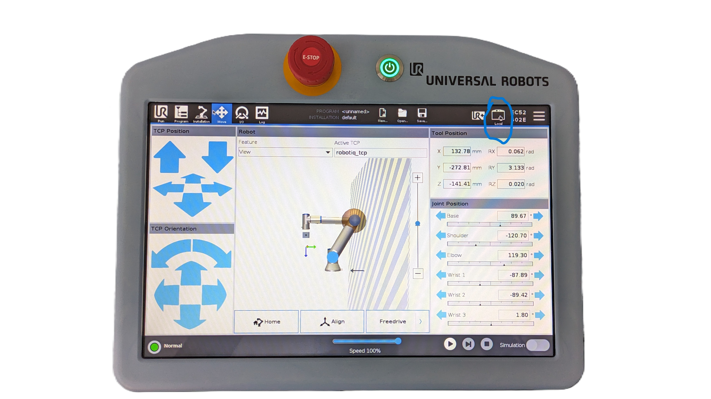

# UR5e RTDE Direct Control Guide

## Overview

This guide covers the Real-Time Data Exchange (RTDE) approach for controlling UR5e robots. RTDE provides direct, low-level access to the robot without requiring ROS2, making it ideal for simple automation tasks, real-time control, and quick prototyping.

## Table of Contents

1. [Prerequisites](#prerequisites)
2. [Installation](#installation)
3. [Robot Setup](#robot-setup)
4. [Available Scripts](#available-scripts)
5. [Basic Usage](#basic-usage)
6. [Gripper Integration](#gripper-integration)
7. [Resources](#resources)

## Prerequisites

### Knowledge Requirements

- Basic Python programming
- Understanding of coordinate systems
- Basic robotics concepts (TCP, joint space vs. Cartesian space)

### Software Dependencies

- Python 3.6+
- ur_rtde library
- numpy (for mathematical operations)

## Installation

### 1. Python Environment Setup

```bash
# Create virtual environment (recommended)
python3 -m venv ur_rtde_env
source ur_rtde_env/bin/activate  # Linux/Mac
# or
ur_rtde_env\Scripts\activate  # Windows

# Upgrade pip
pip install --upgrade pip
```

### 2. Install ur_rtde Library

```bash
# Install from PyPI (recommended)
pip install ur_rtde

# Or install from source for latest features
git clone https://gitlab.com/sdurobotics/ur_rtde.git
cd ur_rtde
pip install -e .
```

### 3. Install Additional Dependencies

```bash
pip install numpy matplotlib
```

### 4. Verify Installation

```python
# Test import
python3 -c "import rtde_control, rtde_receive; print('RTDE installed successfully')"
```

## Robot Setup

### 1. Network Configuration

Follow the network setup from the [main README](../README.md#network-configuration).

### 2. Robot Configuration

1. **Enable Remote Control**:

   - On UR tablet: Enable `Remote Control` that is in the top menu bar of the tablet (check out the attached image)
     
   - **IMPORTANT**: This is different from ROS2 setup - no URCap needed!

### 3. Test Connection

```python
#!/usr/bin/env python3
"""
Quick connection test
"""
from rtde_control import RTDEControlInterface
from rtde_receive import RTDEReceiveInterface
import time

ROBOT_IP = "192.168.1.102"

# Test connection
try:
    rtde_c = RTDEControlInterface(ROBOT_IP)
    rtde_r = RTDEReceiveInterface(ROBOT_IP)

    print("✅ Connected to robot successfully!")

    # Get current pose
    current_pose = rtde_r.getActualTCPPose()
    print(f"Current TCP pose: {current_pose}")

    # Cleanup
    rtde_c.stopScript()
    print("✅ Connection test completed")

except Exception as e:
    print(f"❌ Connection failed: {e}")
```

## Available Scripts

The `ur_rtde/` directory contains several ready-to-use scripts:

### 1. `robot_control_main.py`

**Purpose:** Interactive pick-and-place operations  
**Features:**

- User input for pickup and target positions
- Automatic gripper control
- Safety height management
- Error handling

**Usage:**

```bash
cd ur_rtde
python3 robot_control_main.py
```

### 2. `robot_control_home.py`

**Purpose:** Move robot to home position (set the home position to whatever you want with Cartesian coordinates)
**Features:**

- Predefined safe home position
- Simple one-command operation

**Usage:**

```bash
cd ur_rtde
python3 robot_control_home.py
```

### 3. `robot_functions.py`

**Purpose:** Comprehensive robot control library
**Features:**

- Object-oriented robot controller
- Modular functions (pickup, place, rotate)
- Safety validation
- Error handling

**Key Components:**

- `RobotController` class
- `pickup()` method
- `target()` method
- `pick_and_place()` method
- `home()` method

### 4. `robotiq_gripper.py`

**Purpose:** Robotiq 2F-85 gripper interface
**Features:**

- Gripper activation and control
- Status monitoring
- Position and force control

## Basic Usage

### Example 1: Movement - using Cartesian Coordinates

```python
#!/usr/bin/env python3
"""
Move robot to a specific pose
"""
from rtde_control import RTDEControlInterface
from rtde_receive import RTDEReceiveInterface
import time

ROBOT_IP = "192.168.1.102"

# Connect to robot
rtde_c = RTDEControlInterface(ROBOT_IP)
rtde_r = RTDEReceiveInterface(ROBOT_IP)

# Get current position
current_pose = rtde_r.getActualTCPPose()
print(f"Current pose: {current_pose}")

# Define target pose [x, y, z, rx, ry, rz] in meters and radians
target_pose = [0.3, 0.2, 0.4, 0, 3.14, 0]

# Move to target
velocity = 0.1  # m/s
acceleration = 0.1  # m/s²

print("Moving to target position...")
rtde_c.moveL(target_pose, velocity, acceleration)

# Wait for movement to complete
time.sleep(3)

print("Movement completed!")
rtde_c.stopScript()
```

### Example 2: Using the Robot Controller Class

```python
#!/usr/bin/env python3
"""
Using the RobotController class for structured control
"""
import sys
import os

# Add the ur_rtde directory to Python path
sys.path.append(os.path.dirname(__file__))

from robot_functions import RobotController

def main():
    # Create robot controller
    robot = RobotController()

    # Connect to robot
    if not robot.connect():
        print("Failed to connect to robot")
        return

    try:
        # Get current position
        robot.get_current_pose()

        # Perform pick and place operation
        # Coordinates in mm, rotation in radians
        pickup_x, pickup_y = 300, 200  # mm
        target_x, target_y = 400, 300  # mm

        success = robot.pick_and_place(
            pickup_x=pickup_x,
            pickup_y=pickup_y,
            target_x=target_x,
            target_y=target_y
        )

        if success:
            print("✅ Pick and place completed successfully!")
        else:
            print("❌ Pick and place failed!")

        # Return to home position
        robot.home()

    finally:
        # Always disconnect
        robot.disconnect()

if __name__ == "__main__":
    main()
```

### Example 3: Joint Space Movement

```python
#!/usr/bin/env python3
"""
Move robot in joint space
"""
from rtde_control import RTDEControlInterface
import time

ROBOT_IP = "192.168.1.102"
rtde_c = RTDEControlInterface(ROBOT_IP)

# Define joint positions (in radians)
# [shoulder_pan, shoulder_lift, elbow, wrist_1, wrist_2, wrist_3]
home_joints = [0, -1.57, 1.57, -1.57, -1.57, 0]

# Move to joint position
velocity = 0.5  # rad/s
acceleration = 0.5  # rad/s²

print("Moving to home joint position...")
rtde_c.moveJ(home_joints, velocity, acceleration)

time.sleep(3)
print("Movement completed!")
rtde_c.stopScript()
```

## Gripper Integration

The included `robotiq_gripper.py` provides control for Robotiq 2F-85 grippers:

### Basic Gripper Usage

```python
#!/usr/bin/env python3
"""
Basic gripper control example
"""
import sys
import os
sys.path.append(os.path.dirname(__file__))

from robotiq_gripper import RobotiqGripper
import time

ROBOT_IP = "192.168.1.102"
GRIPPER_PORT = 63352

# Connect to gripper
gripper = RobotiqGripper(ROBOT_IP, GRIPPER_PORT)

if gripper.connect():
    print("✅ Connected to gripper")

    # Activate gripper if needed
    if gripper.get_status() != 3:
        print("Activating gripper...")
        gripper.activate()
        time.sleep(2)

    # Open gripper
    print("Opening gripper...")
    gripper.open(speed=255, force=255)
    time.sleep(2)

    # Close gripper
    print("Closing gripper...")
    gripper.close(speed=255, force=255)
    time.sleep(2)

    # Move to specific position (0-255)
    print("Moving to 50% position...")
    gripper.move(position=128, speed=255, force=255)
    time.sleep(2)

    gripper.disconnect()
    print("✅ Gripper test completed")
else:
    print("❌ Failed to connect to gripper")
```

### Gripper Status Monitoring

```python
# Check gripper status
status = gripper.get_status()
position = gripper.get_position()
current = gripper.get_current()

print(f"Gripper Status: {status}")
print(f"Position: {position}/255")
print(f"Current: {current} mA")

# Status codes:
# 0: Reset
# 1: Activating
# 2: Not activated
# 3: Active
```

## Troubleshooting

### Common Issues

#### 1. "Cannot connect to robot"

**Symptoms:** Connection timeouts, RTDE connection failures

**Solutions:**

```bash
# Check network connectivity
ping 192.168.1.102

# Verify robot is in Remote Control mode
# On UR tablet: Settings → System → Remote Control → Enable

# Check firewall settings
sudo ufw allow from 192.168.1.102

# Test with simple connection script
python3 -c "
from rtde_control import RTDEControlInterface
rtde_c = RTDEControlInterface('192.168.1.102')
print('Connected successfully!')
rtde_c.stopScript()
"
```

#### 2. "Robot not moving"

**Symptoms:** Commands sent but robot doesn't move

**Solutions:**

- Check robot is not in protective stop
- Verify robot is initialized and ready
- Check safety configuration
- Ensure robot is not in manual mode

#### 3. "Gripper not responding"

**Symptoms:** Gripper commands fail or timeout

**Solutions:**

```python
# Check gripper connection
from robotiq_gripper import RobotiqGripper

gripper = RobotiqGripper("192.168.1.102", 63352)
if gripper.connect():
    status = gripper.get_status()
    print(f"Gripper status: {status}")
    if status != 3:
        print("Activating gripper...")
        gripper.activate()
else:
    print("Check gripper power and communication")
```

## Script Configuration

### Modifying Robot IP

All scripts use the default IP `192.168.56.101`. To change this:

1. **Edit individual scripts:**

   ```python
   ROBOT_IP = "192.168.1.102"  # Change this line
   ```

2. **Use environment variables:**

   ```bash
   export UR_ROBOT_IP=192.168.1.102
   python3 robot_control_main.py
   ```

3. **Command line arguments:**
   ```python
   import sys
   ROBOT_IP = sys.argv[1] if len(sys.argv) > 1 else "192.168.56.101"
   ```

### Adjusting Safety Parameters

In `robot_functions.py`, modify these constants:

```python
# Z-height parameters
TRAVEL_Z_HEIGHT = 0.2363  # Height for traveling
PICKUP_Z_HEIGHT = 0.1710  # Height for pickup
TARGET_Z_HEIGHT = 0.1910  # Height for target placement
MIN_SAFE_Z = 0.1660      # Minimum safe Z height

# Movement parameters
DEFAULT_VELOCITY = 0.1    # m/s
DEFAULT_ACCELERATION = 0.1  # m/s²
```

## Resources

### Official Documentation

- [ur_rtde GitLab Repository](https://gitlab.com/sdurobotics/ur_rtde)
- [ur_rtde API Documentation](https://sdurobotics.gitlab.io/ur_rtde/)
- [Universal Robots RTDE Guide](https://www.universal-robots.com/articles/ur-articles/real-time-data-exchange-rtde-guide/)

### Python Libraries

- [ur_rtde PyPI Package](https://pypi.org/project/ur-rtde/)
- [NumPy Documentation](https://numpy.org/doc/)

### Community Resources

- [Universal Robots Developer Forum](https://forum.universal-robots.com/)
- [SDU Robotics Community](https://gitlab.com/sdurobotics)

---
